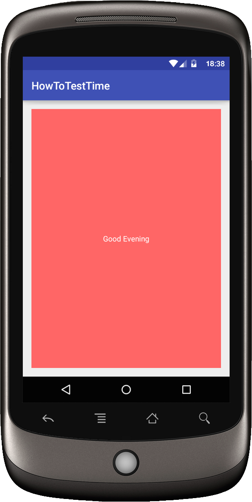

This is code to match the blog post found here: http://blog.blundellapps.co.uk/how-to-test-time-and-control-system-currenttimemillis/

> This post explains how to control time and specifically control System.currentTimeMillis. To make your code more flexible, maintainable and in the end testable! Showing an example application that uses time to define different behaviour for the app in the morning and in the evening. Going on to unit test this in a robust manner.

|Morning|Evening|
| ----- | ----- |
|  |
